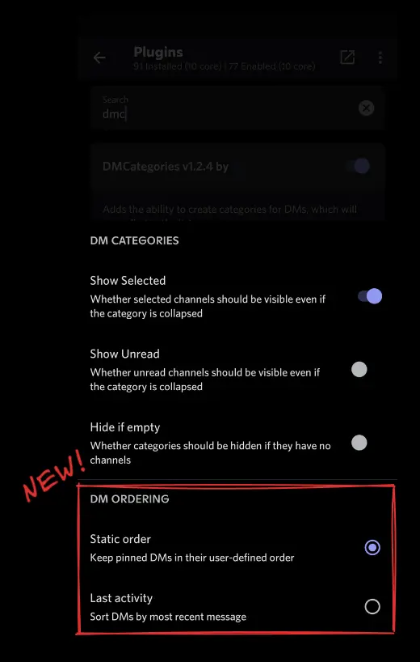
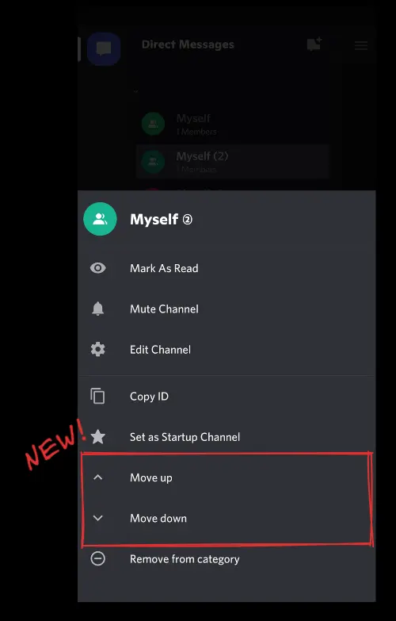

# zt64's Aliucord Plugins, AI-augmented

Original `README.md` :
- [on `main` branch synced with upstream](https://github.com/VibedByKaKi/zt64-aliucord-plugins/blob/main/README.md) ;
- [on `dev` branch at fork time](https://github.com/VibedByKaKi/zt64-aliucord-plugins/blob/e25b9b12c60571e07cb742e52862a1aa247a913a/README.md) ;
- [on upstream `main` branch](https://github.com/zt64/aliucord-plugins/blob/main/README.md).

## Exclusive features

### DMCategories enhancements

Available on the `dev` branch only (not yet on `main`) :

- **Pinned DM static order** — pinned DMs keep their user-defined order instead of being sorted by last activity.
- **DM ordering setting** — choose between *Static order* and *Last activity* in plugin settings.
- **Move up / Move down** — reorder DMs inside a category from the channel context menu.

| Settings | Long-press menu
| --- | ---
|  | 

## Installation

From the [latest `dev` prerelease](https://github.com/VibedByKaKi/zt64-aliucord-plugins/releases/tag/dev), download individual `*.zip` plugin files and move them to `/sdcard/Aliucord/plugins` on your device.
